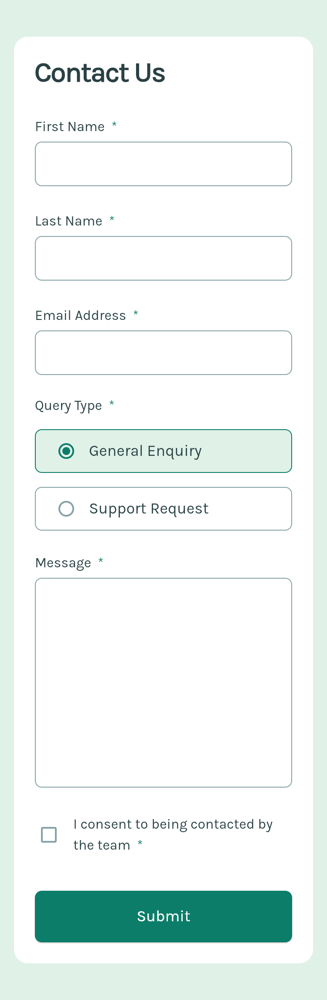
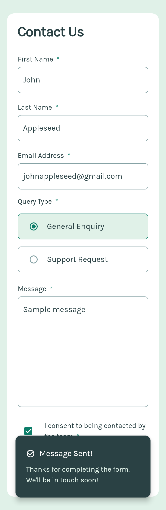

# Frontend Mentor - Contact form solution

This is a solution to the [Contact form challenge on Frontend Mentor](https://www.frontendmentor.io/challenges/contact-form--G-hYlqKJj). Frontend Mentor challenges help you improve your coding skills by building realistic projects.

## Table of contents

- [Overview](#overview)
  - [The challenge](#the-challenge)
  - [Screenshot](#screenshot)
  - [Links](#links)
- [My process](#my-process)
  - [Built with](#built-with)
  - [What I learned](#what-i-learned)
  - [Useful resources](#useful-resources)
- [Author](#author)

## Overview

### The challenge

Users should be able to:

- Complete the form and see a success toast message upon successful submission
- Receive form validation messages if:
  - A required field has been missed
  - The email address is not formatted correctly
- Complete the form only using their keyboard
- Have inputs, error messages, and the success message announced on their screen reader

### Screenshot

### Links

- Solution URL: [Solution](https://github.com/JustANipple/contact_form_flutter)
- Live Site URL: [Live](https://contact-form-a839f.web.app/)

## My process

### Built with

- Dart
- Flutter

### What I learned

In this project i learned how to manage a form, validating it and submitting it

### Useful resources

- [Dart](https://dart.dev/guides) - Making logic with Dart is easier with good docs like these
- [Flutter](https://docs.flutter.dev/) - Flutter docs helped a lot looking for parameters of every widget available

## Author

- Frontend Mentor - [@JustANipple](https://www.frontendmentor.io/profile/JustANipple)
